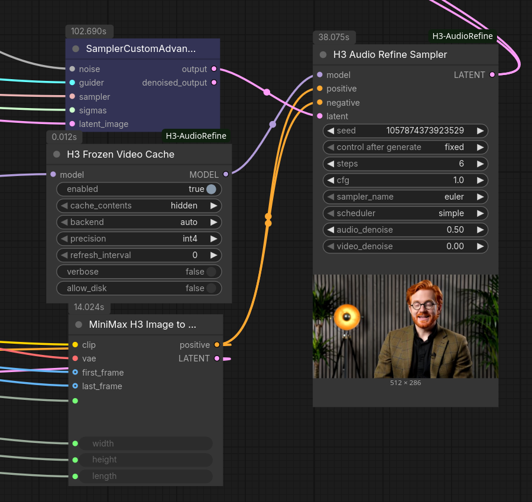

# ComfyUI-H3-AudioRefine

Audio-only refinement pass for MiniMax H3 packed AV latents. v1.0.0.

Freeze the video stream of a sampled H3 latent (e.g. from a 4-step Turbo pass)
and run additional denoising steps on the audio stream only. The intended use
is Turbo-LoRA workflows where 4-step video is acceptable but 4-step audio is
not: pay for a few extra audio steps instead of raising the whole joint pass
to 8-20 steps.

## How it works

ComfyUI's native MiniMax H3 support already contains a masked-inpaint path for
the packed AV latent (`MiniMaxH3.scale_latent_inpaint` /
`_denoise_mask_conds` in `comfy/model_base.py`), and the sampler accepts a
per-stream `noise_mask` as a NestedTensor. This pack builds that mask
(video = 0.0 preserve, audio = 1.0 generate) and runs a partial-denoise pass:

- Each step, the frozen video slice is injected at the visual cond timestep
  (0.999) -- the same treatment keyframe conditioning gets -- so the model
  denoises the audio *in the context of* the finished video.
- The sampler's final masked blend returns the video slice bit-identical to
  the input (at `video_denoise` 0.0).
- The audio stream rides ComfyUI's ModelSamplingAV carry, so its effective
  sigma stays on the trained dual-schedule relationship. No custom sampler.

**Compute expectation:** H3 is a single-stream transformer over one packed
token sequence. Frozen video tokens remain in the sequence as attention
context, so each audio refinement step still costs close to a full forward
pass. The saving is step arithmetic (4 turbo + 4-6 audio ~= 8-10 full-cost
steps vs 20), not per-step cost.

## Example workflow



`SamplerCustomAdvanced` runs the turbo pass; its LATENT goes to `H3 Audio Refine
Sampler`, which takes its MODEL from `H3 Frozen Video Cache` (placed after the LoRA
stack). `positive` is wired into `negative` as well, since `cfg 1.0` never evaluates the
uncond branch.

Sample output from that graph: [`examples/turbo-refined.mp4`](examples/turbo-refined.mp4)
-- 6 turbo steps, then 6 audio-only refinement steps.

The node timings in that screenshot are the honest measurement of what this pack buys:

| | steps | time | per step |
|---|---|---|---|
| Turbo pass (joint video + audio) | 6 | 93.7s | ~15.6s |
| Audio refinement, frozen cache on | 6 | 45.6s | ~7.6s |

The refinement average includes the one full-price cache build, so the steps after it are
considerably cheaper than 7.6s -- that is where the `verbose` per-step log is worth
reading.

## Do I want the frozen cache?

Both paths produce the same kind of result. They differ in what they spend.

**Without the cache** (bypass the node, or just don't add it) the refinement pass is
resource-free -- no extra RAM, no extra VRAM, nothing on disk -- and it is exact, with no
approximation anywhere. The cost is time: because H3 packs video and audio into one
sequence with full bidirectional attention, every refinement step re-runs the entire video
stream through all 50 blocks even though the video is frozen and its output is discarded.
So each audio-only step costs about the same as a full generation step. Six refinement
steps costs roughly what six more generation steps would.

**With the cache**, the frozen rows' per-block state is computed once and reused, so later
steps only compute the audio rows. Refinement steps get substantially cheaper, at three
costs: a chunk of RAM/VRAM/disk to hold the cache (7-8 GB at `hidden`/`int4` on a typical
clip, more at `kv` or lower compression), a first refinement step at full price to build
it, and a mild approximation -- the frozen rows stop reacting to the evolving audio
between rebuilds (see `refresh_interval`).

Rough guidance:

- **Few refinement steps (2-3), or memory is tight.** Skip the cache. The build step eats
  most of the saving, and you avoid the memory entirely.
- **Many refinement steps (6+) and you can spare the memory.** Use the cache. The build
  amortizes and the remaining steps are a fraction of full price.
- **Not sure whether it is helping.** Turn on `verbose` and compare a run with the node
  bypassed against one with it active. The per-step log tells you where the time went
  rather than leaving you to infer it.

## Nodes

### H3 Audio Refine Sampler (all-in-one)

Inputs: `model`, `positive`, `negative`, `latent` (the sampled AV latent),
`seed`, `steps`, `cfg`, `sampler_name` (default euler), `scheduler` (default
simple), `audio_denoise` (default 0.5), optional `video_denoise` (default 0.0).

Wire the first pass's sampler LATENT output straight into `latent`, reuse the
same model stack (including the Turbo LoRA) and conditioning, and take the
refined LATENT to your existing VAE decode nodes. `audio_denoise` controls how
far the audio is re-noised before refinement:

- 0.3-0.6: keep pass-1 audio content, clean up noise floor / artifacts.
- 1.0: regenerate the audio from scratch against the frozen video.

`steps` runs KSampler-style at that denoise depth (the schedule is
`steps / audio_denoise` long and only the tail executes).

### H3 Audio Refine Mask (composable)

Takes the sampled LATENT, attaches the freeze-video / generate-audio noise
mask, outputs LATENT. Feed it to a stock `SamplerCustomAdvanced` (with
`BasicScheduler` at `denoise` = desired audio re-noise depth) or a stock
`KSampler` with `denoise` < 1.0. Use this variant to control the refinement
schedule/guider yourself or to A/B against the all-in-one node.

Optional `video_denoise` > 0.0 partially opens the video stream to the
refinement pass instead of freezing it exactly.

## Suggested starting point (Turbo 4-step)

1. Pass 1: your existing 4-step Turbo graph, unchanged.
2. H3 Audio Refine Sampler: steps 4-6, audio_denoise 0.5, cfg 1.0,
   euler / simple, same model+LoRA and conditioning as pass 1.
3. Decode as usual.

A/B against a straight 6-8 step Turbo run at matched total step count -- that
is the honest baseline this approach has to beat.

## Requirements

- ComfyUI with native MiniMax H3 support including the AV masked path
  (0.33.x verified against master as of 2026-08-21; the per-stream
  denoise-mask handling in `CFGGuider.sample` and
  `MiniMaxH3.scale_latent_inpaint` must be present).
- No extra Python dependencies. No monkeypatching: only public
  `comfy.sample` / `noise_mask` APIs are used.

## Notes / limits

- Refining with a different model stack than pass 1 (e.g. dropping the Turbo
  LoRA for the refinement pass) is allowed by the graph and worth testing,
  but is untested territory: the base model at 4-6 tail steps may fight the
  distilled trajectory the audio was started on.
- `latent` must be a sampled H3 AV latent (nested video+audio). Plain latents
  are rejected with a clear error.
- Conditioning with keyframes/refs is passed through untouched; the frozen
  video mask stacks with them via the native pooled-mask path.

## Changelog

- 1.0.0: Initial release. H3AudioRefineMask, H3AudioRefineSampler.

## H3 Frozen Video Cache

Accelerates the refinement pass. On the first refinement step it runs the model normally
while recording every block's post-rope attention K/V for the frozen rows (text, cond/ref,
video). On every later step it computes **only the audio rows** (~1% of the sequence),
attending against the cached K/V, instead of re-running ~37k video tokens through all 50
blocks.

**Wiring:** place after your LoRA/patch stack, feed the patched MODEL into the refine
sampler (`H3 Audio Refine Sampler` or a stock sampler fed by `H3 Audio Refine Mask`).
The patch self-gates: it only activates when the model is called with the video stream
fully frozen and the audio stream still generating. On the first refinement step it logs
`building cache | rows=... size=... backend=...` to the console -- if you never see that
line, the cache is not engaging and the pass is running at stock speed. Pass-1 sampling, partial video masks, and audio-mask workflows
pass through the stock path bit-for-bit, so the same patched MODEL is safe to wire
anywhere.

**What it costs (honesty section):**
- This is an approximation: between rebuilds, the frozen rows stop reacting to the
  evolving audio. `refresh_interval N` rebuilds the cache every N steps (each rebuild is
  one full-price step) if you want to periodically re-open that feedback path. `0` =
  build once.
- The first refinement step is always full price — it builds the cache.
- Cached steps are not free: model weights still stream per step if your model is
  offloaded to RAM, and the cache itself streams from wherever it lives. Expect cached
  steps to cost roughly (weight streaming) + (cache transfer) + (tiny audio compute),
  not zero.
- The latent preview will show garbage video during cached refinement steps (video rows
  are not computed; the sampler's mask blend restores the real video in the output).
  The final latent is unaffected.

**Cache contents** (`cache_contents` input): the storage/compute dial.
- `hidden` (default) — stores each block's post-norm hidden states (5376/row) and rebuilds
  K/V on the fly each cached step. ~2.7x smaller than `kv`; cached steps keep ~30% of the
  per-block video matmul work (the qkv projection), so expect roughly ~3x faster refinement
  steps. This is the config that fits a RAM-starved box where the model offload pool
  already owns most of system memory.
- `kv` — stores post-rope K/V directly (14336/row). Cached steps are nearly compute-free,
  but you need the room to hold it.

**Backends** (`backend` input): where the cache lives.
- `auto` — picks the first of vram / ram / disk that fits with a 4 GB margin, and prints
  the choice and the reason to the console.
- `vram` / `ram` / `disk` — force a placement. Disk caches live under the ComfyUI temp
  directory and are deleted when replaced.
Cache size is printed on every build **before** allocation. Approximate sizes at
1344×768 / 124 frames (~38k rows, 50 blocks), by contents x precision:

| | `bf16` | `fp8` | `int4` |
|---|---|---|---|
| `kv` | ~55 GB | ~27 GB | ~14 GB |
| `hidden` | ~21 GB | ~10.4 GB | ~5.3 GB |

Sizes scale linearly with row count.

**Other memory the cache uses** (not part of the number above):
- Working VRAM during cached steps: `kv` holds two full-sequence dequant buffers
  (~1.1 GB at full canvas); `hidden` holds one (~0.4 GB) plus the transient full-sequence
  qkv activation (~1.6 GB peak).
- The disk backend stages through two double-buffered pinned blocks (~0.5 GB RAM for
  `kv`/int4, ~0.2 GB for `hidden`/int4).
- If pinned allocation fails under RAM pressure, the RAM backend falls back to pageable
  memory with a console warning (slightly slower transfers, but the cache can swap
  instead of the process being killed).

**Precision** (`precision` input): `int4` (group-128 symmetric; default — smallest and
fastest to stream), `fp8` (per-row scaled e4m3), `bf16` (exact). Verified cached-step
deviation on the test model, both contents modes: bf16 ~0, fp8 ~4e-4 relative, int4
~2e-3 relative — small against the approximation itself, and `hidden` does not amplify
quantization error through the rebuilt projection (measured 0.0022 vs 0.0020 for `kv`
at int4).

**Diagnosing a refinement pass** (`verbose` input): logs one line per model call:

```
cached step | blocks: 50 cached, 0 built, 0 stock (of 50) | block loop 2.1s | whole model call 15.4s | outside blocks 13.3s
```

Read it as follows. `0 of 50` blocks touched (plus a warning) means the block replacement
never ran and the cache cannot take effect at all. A high `block loop` time with 50 blocks
cached means the transformer is still the bottleneck and the cache is not saving what it
should. A small `block loop` next to a large `outside blocks` means the step's time is
being spent outside the transformer entirely -- patchify, text refiner, final layer, or
memory management -- in which case no amount of caching inside the blocks will help.

Every build also logs *why* it rebuilt (`no cache yet`, `video latent changed`,
`conditioning changed`, `layout changed`, `refresh_interval reached`). If you see a build
line on **every** step, the cache is never being reused and the pass is running slower
than stock -- the reason field says what is invalidating it.

**Lifecycle:** the cache persists across queue runs on purpose (re-queueing the same
refine skips the rebuild) and is invalidated automatically by a new video latent (new
seed), a layout change, or eviction (2 slots max). Disk caches live under the ComfyUI
temp directory: stale directories are swept on the next build, orphans are cleared by
ComfyUI's own temp cleanup at startup, and an interrupted build is discarded rather than
left half-written (verified: a post-interrupt run rebuilds cleanly).

**Compatibility:** the cache reuses ComfyUI core's own kernels (fused RMSNorm+rope,
optimized attention, swiglu) so the build step reproduces the stock forward exactly
(verified bit-identical on CPU against core). Core internals are structurally checked at
patch time and per step; any mismatch falls back loudly to the exact path rather than
producing wrong output. If your attention backend cannot handle cross-length q/kv
(audio queries vs full-sequence keys), switch attention backends for the refine pass.
